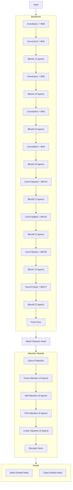

    从这些参数列表中，我可以看出这是一个复杂的神经网络结构，包含backbone和一些特殊的attention模块。让我为您绘制一个清晰的网络结构图。




这个网络结构主要包含以下几个部分：

1. Backbone部分：
   - 一个下采样路径：从conv0到block4，逐步降低特征图分辨率
   - 一个上采样路径：从convtr4到final，逐步恢复特征图分辨率
   - 每个block包含多个卷积层和批归一化层

2. Attention模块：
   - Query Projection：用于投影查询特征
   - Cross Attention：4层交叉注意力模块
   - Self Attention：4层自注意力模块
   - FFN Attention：4层前馈网络
   - Linear Squeeze：4层线性压缩层
   - Decoder Norm：最终的归一化层

3. 输出头：
   - Mask Features Head：用于生成mask特征
   - Mask Embed Head：用于生成mask嵌入
   - Class Embed Head：用于分类预测

从结构上看，这似乎是一个用于实例分割任务的网络，采用了编码器-解码器结构，并结合了多层注意力机制。backbone部分使用了类似U-Net的结构，而attention模块则借鉴了Transformer的设计。想了解更具体的某个部分吗？


从上述输出中可以看出 `all_pred_masks[bid]` 是一个二维数组（numpy `ndarray`），其详细信息如下：

### 数据结构分析

1. **数据类型 (`dtype`)**:
   - 每个元素的类型是 `float32`，意味着掩码中的值是浮点数。

2. **形状 (`shape`)**:
   - `(237360, 222)` 表示有 237360 个点，每个点对应 222 个实例掩码的可能性。

3. **值分布 (`min` 和 `max`)**:
   - 由于数组太大，`min` 和 `max` 没有直接计算，但从结构上推测，值范围可能在 `[0.0, 1.0]` 或更宽范围。

4. **大小 (`size`)**:
   - 总共有 `237360 x 222 = 52693920` 个元素。

---

### 掩码含义

- 每一行对应点云中的一个点。
- 每一列对应一个实例查询结果（一个实例掩码）。
- 值的大小可能表示属于某个实例的可能性，较高的值意味着该点属于某个实例掩码。

---

### 特殊变量分析

数组被划分为多个子块（块大小未明确），这是调试工具的优化以避免直接处理大型数组的性能问题。

- **值范围**:
  从 `[0.0, 0.0, ...]` 的样例看，可能大部分值接近 0（未被实例掩码覆盖）。
- **形状和分块**:
  形状 `(237360, 222)` 分块时仍保持子块的大小一致，便于调试查看。

---

### 检查掩码有效性

可以通过以下代码快速检查掩码的整体特性：

```python
import numpy as np

# 检查全局最大值和最小值
print("Max value in masks:", np.max(all_pred_masks[bid]))
print("Min value in masks:", np.min(all_pred_masks[bid]))

# 检查掩码中非零值的分布
nonzero_elements = np.count_nonzero(all_pred_masks[bid])
print(f"Non-zero elements: {nonzero_elements}, Total elements: {all_pred_masks[bid].size}")

Max value in masks: 1.0
Min value in masks: 0.0
Non-zero elements: 409848, Total elements: 52693920
```

---

### 总结

`all_pred_masks[bid]` 是最终存储二值或概率掩码的变量，其结构为一个二维数组，每行对应点云点，每列对应实例掩码。多数值可能接近零，非零值对应实例掩码覆盖区域。这是存储点云实例分割结果的核心变量。


从代码的输出中可以看出以下内容：

### 数据分析

1. **掩码值范围**:
   - **最大值**: `1.0`，表明掩码中可能存在二值化的结果（1 表示点被实例掩码覆盖）。
   - **最小值**: `0.0`，表明未被实例掩码覆盖的点。

2. **非零值统计**:
   - **非零元素数量**: `409848`，表示所有掩码中被覆盖的点数量。
   - **总元素数量**: `52693920`，说明掩码是稀疏的，大部分点未被覆盖（非零点占比约为 `0.778%`）。

---

### 数据的特性

- **二值特性**:
  掩码值为 0 或 1，说明掩码数据是二值化后的（不是概率值）。

- **稀疏性**:
  非零值占比非常小，说明点云实例掩码对场景的覆盖范围较小。

---

### 推断与验证

1. **掩码的解释**:
   每行代表一个点，每列对应一个实例掩码。值为 `1` 的位置表示该点属于对应的实例。

2. **掩码特性验证**:
   可以进一步验证是否为完全二值化数据：

   ```python
   unique_values = np.unique(all_pred_masks[bid])
   print("Unique values in masks:", unique_values)

   Unique values in masks: [0. 1.]
   ```

   如果输出是 `[0.0, 1.0]`，则完全为二值化数据。

3. **稀疏性与分布**:
   可以进一步分析哪些实例掩码对点云的覆盖较多：

   ```python
   column_sums = np.sum(all_pred_masks[bid], axis=0)
   print("Instance coverage per mask:", column_sums)
   print("Max coverage by an instance:", np.max(column_sums))
   print("Min coverage by an instance:", np.min(column_sums))

   Instance coverage per mask: 
    [3.9550e+03 2.4390e+03 3.2930e+03 7.5200e+02 1.0250e+03 3.1740e+03
    1.0063e+04 3.1880e+03 3.6530e+03 3.0870e+03 3.0500e+03 1.0990e+03
    3.1470e+03 1.3070e+03 3.8720e+03 6.5450e+03 6.7470e+03 4.5020e+03
    2.5000e+03 1.6912e+04 1.2338e+04 2.0000e+00 6.7500e+03 5.9700e+03
    1.0000e+00 1.5360e+03 1.0000e+00 1.0000e+00 3.6840e+03 2.1450e+03
    6.2000e+01 3.4350e+03 2.7500e+02 1.3000e+01 5.0000e+01 1.0000e+00
    1.4000e+01 2.3860e+03 3.2290e+03 5.5650e+03 7.5000e+02 1.3480e+03
    2.0000e+00 2.0000e+00 5.9300e+02 1.4000e+01 2.7000e+01 4.5000e+01
    5.3230e+03 5.1000e+01 7.5000e+01 8.4000e+01 3.0750e+03 2.0000e+00
    1.0000e+02 1.0000e+00 1.0000e+00 3.3000e+01 1.0000e+00 6.0000e+00
    1.0000e+00 1.4000e+01 1.7030e+03 3.0000e+00 2.0000e+00 1.7030e+03
    1.0850e+03 5.0000e+00 1.5800e+03 4.4850e+03 1.0000e+00 2.0000e+00
    6.0000e+00 2.0230e+03 3.6540e+03 3.0000e+00 1.0900e+02 7.7700e+02
    1.0000e+00 1.3680e+03 2.4000e+02 5.0000e+00 2.0000e+00 5.7000e+01
    6.0000e+00 2.0000e+01 6.3700e+02 3.7000e+01 2.0000e+00 5.0000e+00
    6.1650e+03 1.3000e+01 2.0230e+03 3.0000e+00 1.0000e+00 1.0900e+02
    2.1450e+03 4.5010e+03 6.1650e+03 1.0000e+00 2.0000e+00 5.5650e+03
    1.0850e+03 2.3860e+03 2.7000e+01 1.2927e+04 7.5000e+01 5.9300e+02
    5.1000e+01 1.0000e+00 6.7500e+03 1.0000e+02 4.1360e+03 5.1670e+03
    1.4000e+01 6.0000e+00 3.8620e+03 1.0000e+00 3.2710e+03 1.4290e+03
    9.5000e+01 5.0000e+00 1.4000e+01 1.4290e+03 1.0600e+03 4.5000e+01
    2.0000e+00 1.0000e+00 6.9960e+03 1.6180e+03 1.0850e+03 2.0000e+00
    1.7600e+02 2.1000e+01 1.4300e+03 6.1350e+03 2.0000e+00 3.7000e+01
    1.0300e+02 9.8000e+01 5.3000e+01 2.0230e+03 6.0000e+00 3.0000e+00
    6.0000e+00 5.9300e+02 8.2130e+03 1.0900e+02 5.1000e+01 3.2620e+03
    3.4760e+03 3.0640e+03 3.6540e+03 3.6540e+03 1.4000e+01 5.5650e+03
    3.0860e+03 5.0000e+00 2.5270e+03 2.3860e+03 1.0000e+00 2.4820e+03
    6.1350e+03 1.0000e+00 3.6540e+03 7.5220e+03 2.0000e+00 3.0000e+00
    9.8000e+01 3.2700e+02 1.0000e+02 9.0670e+03 4.3000e+01 4.5010e+03
    3.3210e+03 2.3970e+03 2.3860e+03 2.0000e+00 4.5020e+03 4.6100e+02
    1.6800e+02 1.6180e+03 3.8540e+03 1.0535e+04 4.6100e+02 1.0850e+03
    3.3890e+03 6.1650e+03 1.4290e+03 1.7600e+02 3.3380e+03 3.3890e+03
    2.1000e+01 2.0830e+03 1.0000e+02 1.0000e+01 7.2500e+02 3.7890e+03
    5.0000e+01 1.4940e+03 3.6540e+03 4.3130e+03 1.5000e+02 6.0000e+00
    2.0230e+03 3.0000e+00 1.0000e+00 3.0640e+03 3.0000e+01 1.1000e+01
    4.3320e+03 2.0000e+00 3.5400e+03 1.0900e+02 1.8000e+01 3.5400e+03
    2.0000e+00 2.0000e+00 6.3800e+02 5.0000e+00 3.0000e+00 3.0000e+00]
    Max coverage by an instance: 16912.0
    Min coverage by an instance: 1.0
   ```

   这将展示每个实例掩码覆盖的点数量，帮助分析某些实例掩码的重要性。

---

### 应用建议

- 可以优化存储和计算方式，例如将二值稀疏矩阵转换为压缩存储格式（如 `scipy.sparse`）。
- 掩码稀疏性可以帮助识别关键的实例掩码或排除冗余掩码。


从你提供的输出数据中，我们可以得出以下信息：

### **实例掩码覆盖统计**
`Instance coverage per mask` 显示了每个实例掩码（`pred_masks` 的列）的点云覆盖情况，即每个实例掩码覆盖了多少个点。

#### **关键分析：**
1. **值范围**：
   - 最大值：例如 `1.099e+04`（约 10990 个点）表示某个实例掩码覆盖了大范围点。
   - 最小值：例如 `1.0` 或其他较小值，表示某些实例掩码仅覆盖少量点。

2. **稀疏性：**
   - 大部分掩码覆盖的点较少，例如许多掩码覆盖不到 `100` 个点。
   - 少数掩码覆盖了大量点，例如数千个点。

3. **有意义的掩码：**
   - 实例掩码覆盖小于某个阈值（如 `10` 个点）的可能无意义，可以忽略。
   - 大范围覆盖的掩码更可能是实际的目标实例。

#### **下一步分析建议：**

1. **统计掩码分布：**
   可以统计每个实例掩码覆盖点的分布：
   ```python
   import matplotlib.pyplot as plt
   plt.hist(column_sums, bins=50)
   plt.xlabel("Number of Points Covered")
   plt.ylabel("Frequency")
   plt.title("Instance Mask Coverage Distribution")
   plt.show()
   ```

2. **筛选有意义的掩码：**
   通过过滤掩码覆盖的点数，例如只保留覆盖点数大于 `500` 的掩码：
   ```python
   threshold = 500
   meaningful_masks = [i for i, count in enumerate(column_sums) if count > threshold]
   print("Number of meaningful masks:", len(meaningful_masks))
   ```

3. **找到覆盖最多的掩码：**
   找到覆盖点数最多的实例掩码及其索引：
   ```python
   max_coverage = max(column_sums)
   max_coverage_index = column_sums.index(max_coverage)
   print(f"Max coverage: {max_coverage}, by mask index: {max_coverage_index}")
   ```

4. **具体掩码分析：**
   查看特定实例掩码的二值矩阵：
   ```python
   specific_mask = all_pred_masks[bid][:, max_coverage_index]
   print("Shape of specific mask:", specific_mask.shape)
   print("Non-zero elements in specific mask:", np.count_nonzero(specific_mask))
   ```

### **可视化掩码（如点云）**
如果你想在 3D 中可视化某个掩码，可以结合其掩码列（`specific_mask`）和点云坐标（`full_res_coords`）：
```python
specific_coords = full_res_coords[bid][specific_mask.astype(bool), :]
print("Shape of specific_coords:", specific_coords.shape)
# 使用 Open3D 或 matplotlib 可视化 specific_coords
```

通过以上分析步骤，你可以更好地理解每个实例掩码的覆盖范围及其在点云场景中的实际意义。

# 待删
让我按照相同的格式解析Mask-feature computation module这个环节：

Target: 为每个实例掩码计算特征表示（mask-feature representation）
Method: 
- 使用CLIP视觉编码器提取图像特征
- 选择top-k视角的可见性最大的帧
- 计算多尺度图像裁剪
- 平均池化处理

Input: 
- 来自上一步的类别无关掩码提议（class-agnostic mask proposals）
- RGB-D序列帧
- 相机姿态信息

Output:
- 每个实例掩码的特征表示（mask-features）
- 基于CLIP嵌入空间的特征向量

Required by:
1. Open-Vocabulary 3D Instance Segmentation（步骤4）:
   - 用于开放词汇概念的查询
   - 支持自然语言查询和检索
   - 使用CLIP空间进行对象检索

处理步骤：
1. 计算每个实例在各帧中的可见性
2. 选择可见性最高的top-k帧
3. 在选定帧中计算2D对象掩码
4. 进行多尺度图像裁剪
5. 使用CLIP视觉编码器提取特征
6. 对裁剪和视图进行平均池化得到最终特征

优势：
- 任务无关的特征表示
- 可以处理长尾或新颖概念
- 利用CLIP空间实现开放词汇表示
- 通过多视角和多尺度提高特征的鲁棒性

让我详细回答所有问题：

1. 任务是什么？
- 为每个预测的实例掩码计算任务无关的特征表示
- 这些特征表示需要能用于开放词汇概念的查询

2. 输入是什么？
- 来自class-agnostic mask proposal模块的实例掩码
- RGB-D序列帧数据
- 实例掩码提议（接收自第一个环节的输出）

3. 输出是什么？
- 最终的mask-feature representation（掩码特征表示）
- 这是通过多尺度裁剪和多视角平均池化后得到的特征向量

4. 使用的架构是什么？
- CLIP视觉编码器（用于特征提取）
- 平均池化层（用于处理多尺度裁剪和多视角数据）
- top-k选择机制（用于选择最佳可见性的帧）

5. 被哪个环节需要了？
- Open-Vocabulary 3D Instance Segmentation模块（第4步）
- 用于实现开放词汇的对象查询和检索

6. 输入了哪个环节的输出？在哪接收的？
- 接收了第一个环节（Class agnostic mask proposals）的输出
- 在模块开始时接收实例掩码提议
- 使用这些掩码来计算对象在各个帧中的可见性

7. 目的是什么？
- 构建能够查询开放词汇概念的特征表示
- 最大程度保留长尾或新颖概念的信息
- 通过CLIP空间实现更灵活的对象理解和检索
- 突破传统封闭词汇表的限制，实现更通用的对象表示

处理流程：
1. 计算每个实例在RGB-D序列中的可见性
2. 选择可见性最高的top-k视角
3. 在选定帧中计算2D对象掩码
4. 进行多尺度图像裁剪
5. 使用CLIP视觉编码器提取特征
6. 通过平均池化合并多尺度和多视角特征
7. 生成最终的掩码特征表示

# 准备睡觉了


