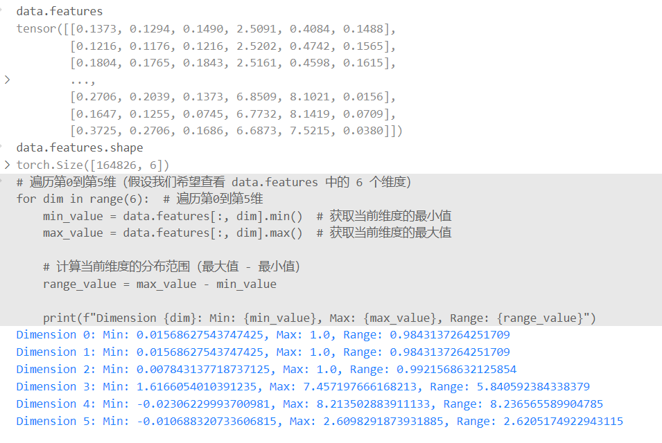

# **1. LIST**


# **2. 待解决问题**
- 数据集里面的3D 是扫描出来的 还是渲染出来的 扫出来的
- It is a collection of labeled voxels rather than points or objects. This dataset is marked in 20 classes of annotated 3D voxelized objects
- OpenIns里面说的 rendering耗时长 但是 PointCLIP里面也没有涉及到渲染的
- 为什么OpenMask3D里面的text query是模糊抽象的 不是围绕着label展开的？
- 为什么数据集都不使用 颜色？ 如果3d里面使用颜色会怎么样？ 3D里面无法得到第一手颜色信息？所以说明3D里面的重建是 计算出来的 不是扫描出来的
- 如果三维场里面的点颜色都是一个颜色 对于分割识别话会有影响吗？扫描的得到的点没有颜色的
- 超点的含义是什么？
- 所有3D OVD任务的评估标准是 acc 和 IoU具体指的是什么？
- OpenMask3D
  - 120 201关系是什么？
  - 为什么最后是 120 → 222 (还是200 201 222？) 好像是经过DBSCAN拆分了一下 增加到了222 确保空间连续性
  - 237360 是如何 164826是怎么减少的？ 体素化 还是离散化？目前判断应该是体素
- 通过实际的结果反推改进方法是不是有点蠢？
- 可见点的存在，在哪几个环节又作用影响
- 数据集获取
- 下一次跑的时候把image的原始index标上 便于判断crop的主要对象
  
```python
  if(save_crops):
      cropped_img.save(os.path.join(out_folder, f"crop{mask}_{view}_{level}.png"))
```


# **3. 1203 Ideas**
## **A 旋转不变 [OpenIns3D]** 
## **训练信息where?** 
### **Background**
**3D-Rotation-Equivariant Quaternion Neural Networks**
- 将各种3D点云处理的神经网络修改为旋转等变和排列不变的四元数神经网络(REQNN)
- 当神经网络使用四元数特征时,网络特征天然具有旋转等变性。旋转等变是指,对输入点云施加特定旋转变换,等价于对所有中间层四元数特征施加相同的旋转变换。
- REQNN同时确保中间层特征对输入点的排列是不变的。相比原始网络,REQNN表现出更高的旋转鲁棒性。

### **Motivation**
**？？？在什么场合下缺失了方向信息？→ 所以需要引入RE特征**


- 借用OpenIns3D的思路通过拍照片去考虑只有3D点云数据input的情况
- 此时得到的snap照相会因为选取的角度不同而通过2D feature extractor得到的特征向量迥异 → 故而导致干扰正确的标签推理
- 如何通过？控制人为截图(在掌握 等差角度/焦距缩放/自定义外参内参等)来量化不同视角下截图input output的特征向量的关系，使得彼此之间可以**融合/找到共性？→ 避免角度差异化带来的推理困难** 
- 特征拼接？复制2D的特征*3 然后拼接在下面？（没太明白）
### **Ideas**
**一般面对提高视角不变旋转不变的鲁棒性的常用/可能方法：**
- **数据增强** 在训练2D特征编码器时,可以将同一物体的不同视角图像作为正样本对。这可以让编码器学习到视角变化下应该具有的不变性。可以显式地在损失函数中约束不同视角特征的相似性。~~（选择视角有限 也需要自定义 计算成本高 并非所有视角下的特征都是需要完全一致的,过强的相似性约束可能影响特征的判别力）~~
- 
- **基于几何的特征变换** 利用点云中的几何信息,显式地对2D特征图进行对应的旋转、平移等变换,使得变换后的特征对齐到统一坐标系下。这需要知道准确的相机参数。~~（这个是不是OpenIns3D需要考虑的问题 如何对其snap得到截图 手工设计变换方式snap方式还是有限且不能自定义）~~
- 
- **【?】基于注意力机制的特征校准** 通过attention机制动态地调整不同视角特征的权重,使得聚合后的特征能够对齐。类似Transformer架构中的self-attention。~~（对Transformer的理解还不够深刻.. 胡思乱想的）~~
- 
- **【?】基于视图间蒸馏的特征对齐** 利用教师-学生网络架构,让不同视角的特征互相迫使对方接近目标表示。~~（这个在GGSD 这篇优化distillation环节中 遇到过自蒸馏的方法？此外，不同视角网络之间的互蒸馏如何权衡,是一个需要仔细调节的超参数）~~
- 
- **【引入旋转等变的卷积】 常规卷积对旋转并不等变,REQNN结构具有旋转等变性,对于视角变化导致的旋转可能有更好的鲁棒性。** ~~（旋转不变是否适用于2D的特征关系中？ 网络是需要train的？）~~


## **B 小物体/被遮挡 [Open3DIS]**
### **Motivation**

**Figure 2. Overview of Open3DIS.**   
A pre-trained class-agnostic 3D Instance Segmenter proposes initial 3D objects, while a 2D Instance Segmenter generates masks for video frames.   
Our 2D-Guided-3D Instance Proposal Module (Sec. 3.1) combines superpoints and 2D instance masks to enhance 3D proposals, integrating them with the initial 3D proposals.   
Finally, the Pointwise Feature Extraction module (Sec. 3.3) correlates instance-aware point cloud CLIP features with text embeddings to generate the ultimate instance masks.  


### **Ideas**


## **C 鲁棒性检验 旋转之后的识别率变化**
### **Motivation**
### **Ideas**

### **测验实验**


# **4. 1206 Ideas**
## **1. RPN**
```josn
随机生成100个框
【RPN Region Proposal Network】 
选出最有可能是人类的框 选取 框内的局部特征 和 text的相似度最高 保留这个框 和 text连接 所以被分类为 person
that is why 是label嵌入text中 去做定量的结果精度
【为什么是点的特征而不是 直接mask特征呢？ 如何合并呢？边界点 聚类点】
```

### **矫正与补充**：
1. **随机生成框**：RPN (Region Proposal Network) 实际上并不是随机生成框，而是通过一个深度学习模型生成一组候选的区域框（proposals）。这些框的生成基于特定算法，它们通常覆盖可能包含目标的区域。
   
2. **最有可能是目标对象的框**：RPN 通过分类和回归对这些候选区域进行筛选和优化，挑选出最可能包含目标的框。
   
---

### **RPN 的主要步骤**

1. **输入图像特征**：
   - 图像经过深度卷积神经网络提取特征后，生成特征图（Feature Map）。这些特征图包含空间和语义信息，是 **RPN 的输入**。

2. **生成候选区域框（Proposals）**：
   - 在特征图的每个位置上，RPN 使用**滑动窗口**操作生成多个**初始区域候选框（anchors）**。这些 anchors 的大小和纵横比通常是预定义的，覆盖图像中的不同区域。

3. **分类和回归**：
   - **分类**：每个候选框被预测为两类之一——**“包含目标”或“背景”**。
   - **回归**：对每个候选框的位置进行调整，以更精确地匹配目标对象的位置。

4. **筛选和优化**：
   - 筛选出**高置信度**的候选框（即分类概率较高的框）。
   - 通过非极大值抑制（NMS, Non-Maximum Suppression）去掉重叠度较高的框，保留最佳的目标区域。

5. **特征提取（可选）**：
   - 对于保留的候选框，提取局部的视觉特征。这些特征可以进一步用于目标检测或识别任务。

---

### **CLIP 原理**：
CLIP（Contrastive Language–Image Pre-training）是由 OpenAI 提出的多模态模型，它的主要目标是通过自然语言与图像进行对比学习，建立两者之间的关联。以下是 CLIP 的工作原理：

1. **输入**： 
   - 图像 $I$：一张任意的图片。
   - 文本描述 $T$：与图像内容相关的文字。

2. **特征提取**：
   - 图像 $I$ 被输入到视觉编码器（通常是一个预训练的卷积神经网络，如 ResNet 或 ViT），输出图像特征 $f_I$。
   - 文本 $T$ 被输入到文本编码器（通常是一个基于 Transformer 的架构，如 GPT），输出文本特征 $f_T$。

3. **特征对齐**：
   - 两种特征被映射到一个共享的嵌入空间（embedding space），即 $f_I$ 和 $f_T$ 是同一个高维向量空间中的点。

4. **对比学习目标**：
   - 使用对比学习损失（Contrastive Loss）来优化模型，使得：
   - 正样本对（图像与其正确的文本描述）在嵌入空间中的距离尽可能近。
   - 负样本对（图像与不相关的文本描述）在嵌入空间中的距离尽可能远。

5. **推理阶段**：
   - 给定一个图像 $I$ 和多个文本描述 $T_1, T_2, \dots, T_n$，计算每对 $(I, T_i)$ 的相似度，选择相似度最高的文本 $T_k$ 作为图像的描述。


---

## **2. base & novel class**
```json
在2D这边 【Base class】 【Novel class】

3D zero shot 和 few shot？ 这个分组有什么要求吗？Open3DIS中主要是向Scannet看齐以做到公平对比

3DIS 训练谁呢？有训练的部分吗？开放了什么权重参数 目前来看只re-train了这个部分

Mask3D只在Scannet 20上train过 开放参数 51
```

### **2D中base/novel**
1. 基本概念解析：
- Base classes: 训练集中有标注的已知类别
- Novel classes: 测试时遇到的未知/新类别
- 开放集检测的目标是要同时实现对已知类别的准确检测和对未知类别的可靠识别

1. 使用CLIP模型进行refinement的主要步骤：

~~a) 特征提取阶段：~~
- ~~利用CLIP的图像编码器提取图像特征~~
- ~~使用CLIP的文本编码器获取类别名称的文本特征~~
- ~~这些特征都位于同一个多模态空间中~~

b) Base Class训练：
- 使用有标注的base class数据进行监督学习
- 构建对比学习损失函数:
```python
def contrastive_loss(image_features, text_features, temperature=0.07):
    # 计算图像和文本特征之间的相似度
    logits = torch.matmul(image_features, text_features.T) / temperature
    labels = torch.arange(len(image_features))
    return cross_entropy(logits, labels)
```

~~c) 特征空间优化：~~
- ~~引入度量学习来增强类内紧密性和类间可分性~~
- ~~常用的度量包括:~~
  - ~~余弦相似度~~
  - ~~欧氏距离~~
  - ~~Mahalanobis距离~~

d) Novel Class适应：
- 构建基于base class知识的原型表示
- 设计新类别发现机制，例如：
```python
def detect_novel_class(feature, base_prototypes, threshold):
    # 计算特征与所有base class原型的最大相似度
    max_similarity = max([cosine_similarity(feature, proto) for proto in base_prototypes])
    # 如果最大相似度低于阈值，认为是novel class
    return max_similarity < threshold
```

e) 模型refinement策略：
1. 特征对齐：
- 利用base class数据调整CLIP特征空间
- 通过对比学习使视觉特征和语义特征更好对齐

2. 判别边界优化：
- 引入margin-based损失函数增强类别区分性
- 设计自适应阈值机制处理novel class

3. 置信度校准：
- 使用temperature scaling等方法调整预测置信度
- 引入能量得分或不确定性估计

示例代码框架：
```python
class OpenSetDetector(nn.Module):
    def __init__(self, clip_model):
        super().__init__()
        self.backbone = clip_model
        self.prototype_layer = PrototypeLayer()
        self.uncertainty_estimator = UncertaintyEstimator()
    
    def forward(self, image):
        # 提取特征
        image_features = self.backbone.encode_image(image)
        
        # 计算与base class原型的相似度
        similarities = self.prototype_layer(image_features)
        
        # 估计预测不确定性
        uncertainty = self.uncertainty_estimator(image_features)
        
        # 综合判断是否为novel class
        is_novel = self.detect_novel(similarities, uncertainty)
        
        return similarities, is_novel
```

这个refinement过程的关键在于：
1. 充分利用CLIP预训练模型的多模态知识
2. 通过base class学习建立可靠的特征表示
3. 设计有效的novel class检测机制
4. 保持模型在已知类别上的性能

通过这种方式，可以使模型既能够准确识别已知类别，又能够可靠地检测未知类别，从而实现更好的开放集检测性能。
需要注意的是，这个过程需要仔细平衡以下几个方面：
- 特征提取的质量
- base class学习的充分性
- novel class检测的灵敏度
- 计算效率和实时性要求


### **Open3DIS setting**

```json
"To assess the generalizability of our approach, we conducted an additional experiment where the class-agnostic 3D proposal network is substituted with the one trained solely on the ScanNet20 dataset."  
→ 为了评估我们方法的泛化能力，我们进行了一个额外的实验，其中将**the class-agnostic 3D proposal network**替换为仅在ScanNet20数据集上训练的网络。

"We then categorized the ScanNet200 instance classes into two groups: the base group, consisting of 51 classes with semantics similar to ScanNet20 categories, and the novel group of the remaining classes."  
→ 然后，我们将ScanNet200实例类别分为两组：the base group（包含51个与ScanNet20类别语义相似的类别）和由剩余类别构成的novel group。

"We report the APnovel, APbase, and AP in Tab. 3."   
→ 我们在表3中报告了APnovel（新类别平均精度）、APbase（基础类别平均精度）和AP（总体平均精度）。

"Our proposed Open3DIS achieves superior performance compared to PLA [11], OpenMask3D [64], with large margins in both novel and base classes."    
→ 我们提出的Open3DIS与PLA[11]、OpenMask3D[64]相比取得了更优越的性能，在新类别和基础类别上都有较大的优势。

"Notably, PLA [11], trained with contrastive learning techniques, falls in a setting with hundreds of novel categories."    
→ 值得注意的是，使用对比学习技术训练的PLA[11]适用于包含数百个新类别的场景。
```

文段表达的核心意思：
这段文字描述了一个实验设计和结果，研究者通过在ScanNet数据集上的实验来验证他们提出的方法在3D实例分割任务中的泛化能力。他们将类别分为基础类别和新类别两组，并通过比较不同方法在这两类上的性能来证明其方法的优越性。

Base class和Novel class之间的关系：
1. 分类基础：Base class（基础类别）是与训练集ScanNet20语义相似的51个类别(51/200-class)，而Novel class（新类别）是剩余的未在训练集中出现的类别。
2. 评估目的：分别评估模型在已知（base）和未知（novel）类别上的性能，以验证模型的泛化能力。
3. 性能衡量：通过APbase和APnovel分别衡量模型在两类别上的表现，综合反映模型的整体性能。
4. 方法验证：通过同时在base class和novel class上取得良好性能，证明了所提方法的有效性和泛化能力。

这种base/novel分类方法是评估模型泛化能力和开放集性能的重要手段，能够全面反映模型在已知和未知类别上的表现。

## **3. SAM分割/ CLIP上下文**
```json
【超点】代替随机筛出点
【聚类】提升性能高吗？连续性物体
```

### **Motivation**
1. **SAM的目的**   
- 喂给CLIP的时候可以知道主要的选取对象(mask的主要作用 最核心的是得到mask的feature) 一张完整图片里面的对象杂乱
2. **CLIP local region不敏感**   
- CLIP在预训练时候投入的图片是完整的 没有扣图的 是有周边场景信息的    
- 已经有论文证实这样的tight crop反而得到的 image_features影响后续判断    
- 如果固定的膨胀裁切系数是0.1的话 对于大物体和小物体是不平衡的 上下文信息保留量不同 对物体的识别也不同
3. **SAM的取点特点**  
- 是(flag)输入的点 很重要很敏感 但是mask是没有filter的 如何在这个环节上切去错误的project pixels  
- (flag)SAM目前被证实 点的选择约简单 准确越好  
  - OpenMask3D的应对是 随机筛选 剔除 时间长计算量大筛选性能不够  
  - Open3DIS是通过超点来上采样点的选择 (flag) 来避免SAM的分隔差错？   
4. **小物体的捕捉 【可见性】【遮挡问题】**  
- (flag) 目前的acc都在大型物体上较高 但是对于小物体 物理大小像素分布较少的objects 很难捕捉同时又能包含上下文信息  
- (flag) superpoint的实际作用是在哪被发挥的 还可以发挥在那些地方？
- 细化mask 再层次聚类合并mask 以捕捉可能遗漏的小物体 mask


### **相关探索**
```json
找小物体
在任何一张图片中都不是一个主角，需要如何把控好上下文信息？ 此时和大物体之间的区别？所以不可以固定系数
CNN卷积去得到完整图片之后的局部特征（代替crop）
找一找有没有scannet RoI 训练 Scannnet ROI 的 base/Novel
ViLD 

如果自蒸馏的话 没有正确答案 
不蒸馏 分类结果 蒸馏mask feature 直接蒸馏特征 结构更好的作为学生
```
所以对于CLIP来说希望不是完全是排他的crop   
→ 所以扩大crop 三个尺寸的image输入    
→ 对于大物体会不会出现反而识别不到的问题 这里的膨胀系数需要实验探索(?)或者OpenMask已经探索了 0.1 0.2是最好的？    
→ 对于小物体会不会出现一旦膨胀就喧宾夺主了失去主角性了    
→ 同样的问题会出现SAM面对 非常离散不连续的mask proposal(可以通过DBSCAN解决) 或者 过于敏感导致扩大了原本版图 (这个对于大物体而言 一般是无伤大雅的 对于小物体就非常致命 也就是 点过于少形不成mask 会被筛出掉 如果点的数量够格了 往往因为精度问题超过原本的小物体在2D中的像素范围 喧宾夺主的情况会常见)    
→ 如何找到一种自适应？包含周边环境/crop尺寸得当 主要是提升的是小物体的捕捉表现  
→ 一视同仁的看周边上下文信息的点会不会有问题？ 权重是不一样的


重叠问题也就是mask之间会不会overlap？
align的方法？
Attention 选点 不同层选点
region CLIP
mask的提升？
子集 / 点的dense Mask3D时效性  PointConv？ 实验一下 坐标方法恢复到一般Mask3D见识过的场景规模
Network针对不同密度的提取

# **5. 1208 OpenMask3D Debug**





选择mask会提高抽象定性查询的性能 考虑到整体性

# **1210Ideas**

1. 3D point cloud的 缩放 子区域的强制注意力转移 (顾虑点 子区域在简化计算的时候有出现过 flag 
   预先训练模型 应该考虑过 或者尺寸缩放一定程度上 改变了特征一个杯子 放大到一个冰箱的尺寸 会有差别)

重叠问题也就是mask之间会不会overlap？
align的方法？
Attention 选点 不同层选点
region CLIP
mask的提升？
子集 / 点的dense Mask3D时效性  PointConv？ 实验一下 坐标方法恢复到一般Mask3D见识过的场景规模
Network针对不同密度的提取


