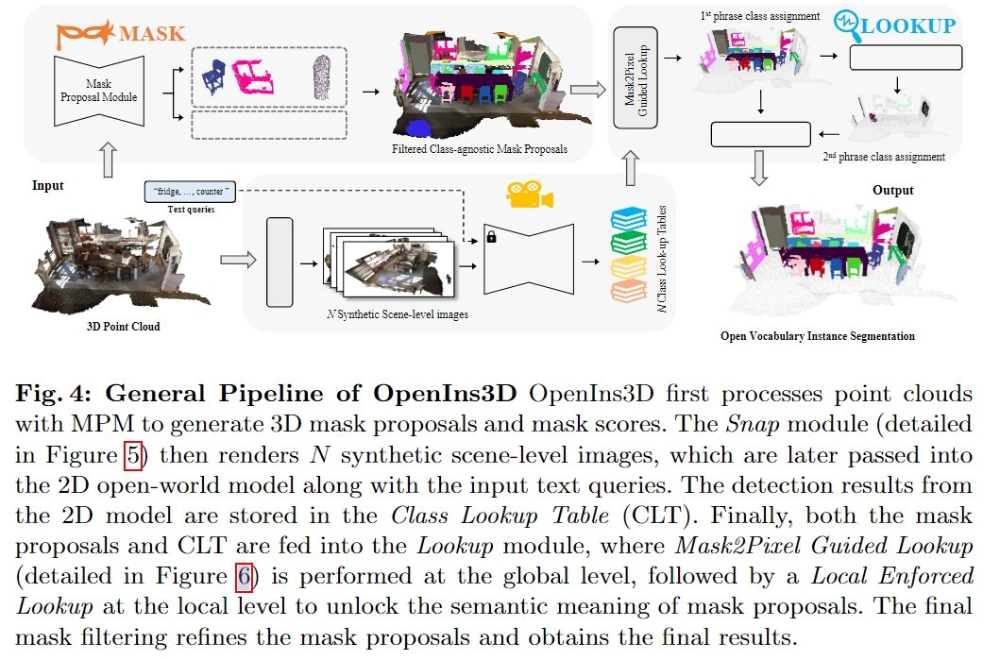

<!-- # OpenIns



--- -->

# Open-YOLO3D

[**code**](https://github.com/aminebdj/openyolo3d)
任务类型：Instance Segmentation 
复现进展：
- 在所有实验中,使用单个 NVIDIA A100 40GB GPU

- 代码部分路径有问题？无法加载module？？父文件夹搞晕了 我看issue里面有人问这个问题hh

---

# Open3DIS
[**code**](https://github.com/VinAIResearch/Open3DIS)
任务类型：Instance Segmentation （2D Mask）
复现进展：暂无

---


# OpenIns
[**code**](https://github.com/OpenMask3D)
任务类型：Instance Segmentation (w/o image)
复现进展：

Hardware: one 24G memory GPU is sufficent to produce all results
```python
File "/root/autodl-tmp/oi/openins3d/mask2former/data/datasets/register_coco_panoptic_annos_semseg.py", 
line 133, in register_coco_panoptic_annos_sem_seg
    delattr(MetadataCatalog.get(panoptic_name), "thing_classes") # flag
AttributeError: thing_classes
```

---
这个错误是由于 `MetadataCatalog.get(panoptic_name)` 对象没有 `thing_classes` 属性导致的。这可能是因为 COCO 数据集已经被修改过,或者代码试图访问一个不存在的属性。

1. 在尝试删除 `thing_classes` 属性之前,先检查一下这个属性是否存在。

```python
if hasattr(MetadataCatalog.get(panoptic_name), "thing_classes"):
    delattr(MetadataCatalog.get(panoptic_name), "thing_classes")
```

1. 如果 `thing_classes` 属性不存在,手动设置它。

```python
metadata = MetadataCatalog.get(panoptic_name)
if not hasattr(metadata, "thing_classes"):
    metadata.thing_classes = [...] # 手动设置 thing_classes
```

3. 另一种方法是使用 try-except 块来捕获 `AttributeError` 异常,并优雅地处理它。

```python
try:
    delattr(MetadataCatalog.get(panoptic_name), "thing_classes")
except AttributeError: # 处理异常,比如记录错误、跳过操作或手动设置 thing_classes
    pass
```
---

# OpenScene
[**code**](https://github.com/pengsongyou/openscene)
任务类型：3D semantic segmentation (point wise)
复现进展：全部跑通 
- train
- eval:fusion/distill/ensemble
- ~~kill问题 (显存换成L20 48GB)~~

---

# OpenMask3D

[**code**](https://github.com/OpenMask3D)
任务类型：Instance Segmentation (mask wise)
复现进展：
```
卡在：模型参数格式不对无法加载
if not isinstance(config.backbone, dictconfig): 
print("[debug] converting config.backbone to dictconfig...")
```
### **1128**
```pthon
目前情况貌似更加离谱了 出现了一堆库不兼容的问题，然后就是先帝创业中道崩殂
```


